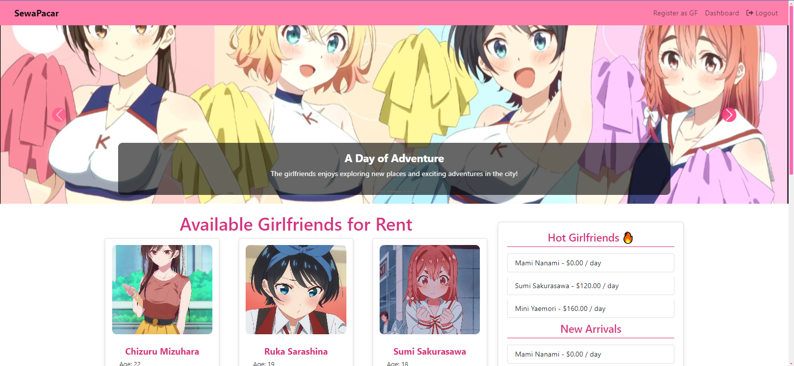
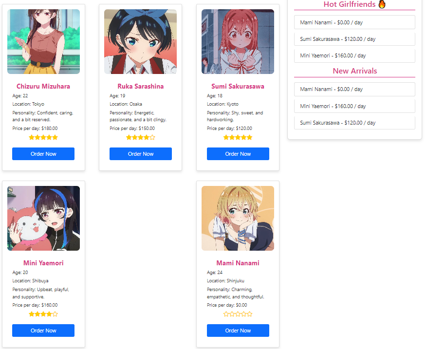

   
  

  
  

# Rent a Girlfriend

## Overview
"Rent a Girlfriend" is a web application built using PHP and MySQL that allows users to browse and rent virtual girlfriends. This project serves as my first foray into PHP programming and database management, showcasing my learning journey in web development.

## Features
- **User Registration**: Users can register as girlfriends and be listed on the platform.
- **Dynamic Listings**: Users can view available girlfriends with detailed information, including age, location, personality, and price.
- **Responsive Design**: The application automatically redirects mobile users to a mobile-friendly version of the site.
- **Rating System**: Users can leave reviews and ratings for girlfriends, enhancing the overall experience.
- **Admin Dashboard**: Admin users can access a dashboard to manage listings and reviews.

## Technologies Used
- **PHP**: Server-side scripting language for dynamic content.
- **MySQL**: Database management system for storing user and girlfriend data.
- **HTML/CSS**: For the structure and styling of the website.
- **Bootstrap**: CSS framework for responsive design.
- **JavaScript**: For interactive features on the frontend.

### Preview

## Future Improvements
- Implement user authentication with password hashing for added security.
- Enhance the user interface for better user experience.
- Introduce a messaging system for users and girlfriends.
- Optimize database queries for performance.

## Contributing

Contributions are welcome! If you have suggestions, improvements, or bug fixes, please submit a pull request or open an issue.

- **Fork the Repository**: Create a personal copy of the repository on GitHub.
- **Make Changes**: Implement your changes and test them locally.
- **Submit a Pull Request**: Describe your changes and submit a pull request for review.

Feel free to use, modify, and build upon this project. If you make any improvements or modifications, please give credit to the original creator.

## License

This project is licensed under the MIT License. See the [LICENSE](LICENSE) file for details.
## License
This project is open-source and available under the MIT License.
